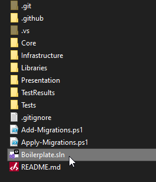
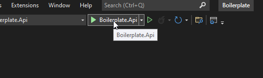
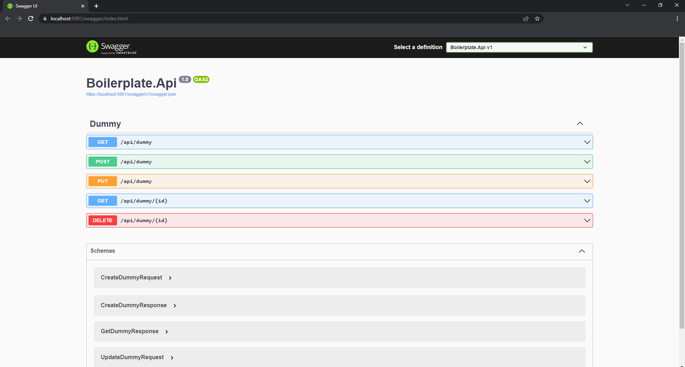
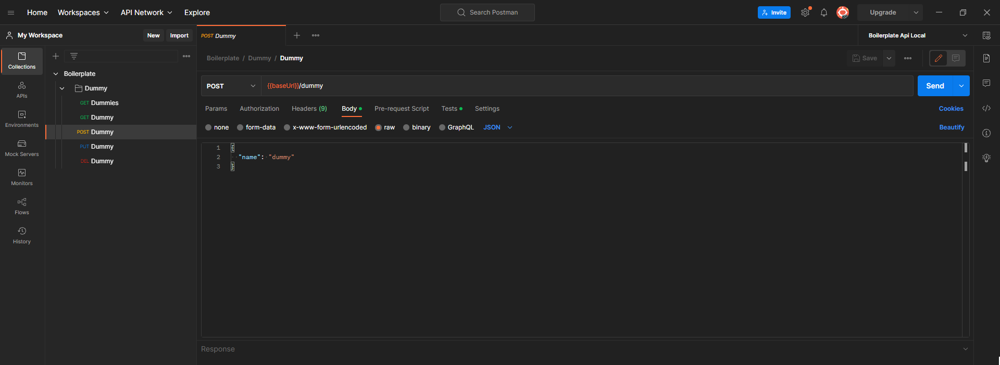
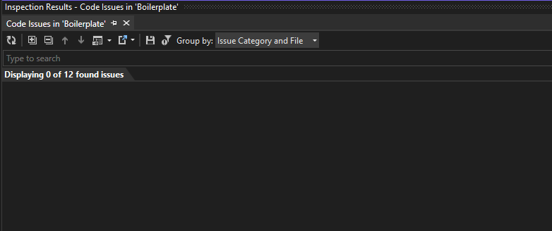

# Boilerplate

[](https://sonarcloud.io/summary/new_code?id=Luxury-Sapanca_Boilerplate)
[](https://sonarcloud.io/dashboard?id=Luxury-Sapanca_Boilerplate)
[](https://sonarcloud.io/summary/new_code?id=Luxury-Sapanca_Boilerplate)
[](https://sonarcloud.io/summary/new_code?id=Luxury-Sapanca_Boilerplate)
[](https://sonarcloud.io/summary/new_code?id=Luxury-Sapanca_Boilerplate)
[](https://sonarcloud.io/summary/new_code?id=Luxury-Sapanca_Boilerplate)
[](https://sonarcloud.io/summary/new_code?id=Luxury-Sapanca_Boilerplate)
[](https://sonarcloud.io/summary/new_code?id=Luxury-Sapanca_Boilerplate)
[](https://sonarcloud.io/summary/new_code?id=Luxury-Sapanca_Boilerplate)
[](https://sonarcloud.io/summary/new_code?id=Luxury-Sapanca_Boilerplate)
[](https://github.com/Luxury-Sapanca/Boilerplate/actions/workflows/build.yml)


### Table of Contents
  
<ol>
  <li>
    <a href="#about-the-project">About The Project</a>
    <ul>
      <li><a href="#built-with">Built With</a></li>
    </ul>
  </li>
  <li>
    <a href="#getting-started">Getting Started</a>
    <ul>
      <li><a href="#prerequisites">Prerequisites</a></li>
      <li><a href="#installation">Installation</a></li>
    </ul>
  </li>
  <li><a href="#usage">Usage</a></li>
  <li><a href="#usage">Business Rules</a></li>
  <li><a href="#usage">Screenshots</a></li>
  <li><a href="#usage">What Is Next?</a></li>
</ol>


## About The Project

The project is a template for new projects. It is always an ongoing project in order to adapt it to the newer versions of .NET environments. There is a CRUD operation with one entity. Also, the project includes security, tests, mappings, repository, middlewares, and so on.

The main point of the project is to create a base for new projects. 


### Built With

You can find the used technologies below.

<p>
	<a href="#"></a>
	<a href="#"></a>
	<a href="#"></a>
	<a href="#"></a>
	<a href="#"></a>
	<a href="#"></a>
	<a href="#"></a>
	<a href="#"></a>
	<a href="#"></a>
	<a href="#"></a>
	<a href="#"></a>
</p>
<br /><br />


## Getting Started

### Prerequisites

* Visual Studio should be installed in order to reach the code. (https://visualstudio.microsoft.com/tr/downloads/) Other compilers like Visual Studio Code, Rider and so on. works as well.
* .NET 6 SDK and .NET Core Runtime should be installed. SDK is for development purposes and runtime is for running the project. (https://dotnet.microsoft.com/en-us/download/dotnet/6.0)
* Postman should be installed for the collections. (https://www.postman.com/downloads/) Requests are ready to use in collections so you can use it in order to test the API.

### Installation

You can find two ways to start the project below.

First way;
1. Clone the repo
```sh
   https://github.com/Luxury-Sapanca/Boilerplate.git
   ```
2. Find the <mark>Boilerplate.Api</mark> folder and run the project
```sh
   C:\Projects\Boilerplate\Presentation\Boilerplate.Api>dotnet run
   ```

Second way;
1. Open the solution with Visual Studio<br /><br />
   <a href="#"></a>
2. Run the project<br /><br />
   <a href="#"></a>


## Usage

There are endpoints for dummies in order to add, update, delete and get them by using database. You can find the related endpoints below.
```sh
   (GET) {https://localhost:5001/api/dummy
   ```
```sh
   (GET) https://localhost:5001/api/dummy/1
   ```
```sh
   (POST) https://localhost:5001/api/dummy
   ```
```sh
   (PUT) https://localhost:5001/api/dummy
   ```
```sh
   (DELETE) https://localhost:5001/api/dummy/1
   ```

There are two ways to use the endpoints of the Boilerplate Api. The first way is to use Swagger which is integrated to API. The second way is to use Postman collections. The requests are ready to use in Postman collections.

<b>Swagger</b>

You can see the details about the requests by clicking the endpoint like below. You should execute after setting the request. <br /><br />
   <a href="#"></a>

<b>Postman</b>

There are environment and collection files under docs/postman folder. You should import them to your Postman workspace by applying the steps in https://learning.postman.com/docs/getting-started/importing-and-exporting-data/.

After that, you can work on endpoints by modifying the requests.<br /><br />
  <a href="#"></a>


## Business Rules

There no business rules in Boilerplate API.


## Screenshots

* I checked the code issues with ReSharper.<br /><br />
	<a href="#"></a>


## Code Quality

As you can see in the beginning of document, the project is integrated to Sonarqube Cloud. You can find the statistics of code smells, vulnerabilities, security hotspots and bugs. You can check the Sonarqube dashboard via https://sonarcloud.io/project/overview?id=Luxury-Sapanca_Boilerplate
	

## What Is Next?

You can find a couple of advices below in order to make the Insurance API better.

* Adding NewRelic (free) to show the logs in console and txt file (maybe Sentry integration)
* Adding fluent validation
* Adding mock library to put all mock objects into one place
* Adding Swagger specifications
* Adding summary comments
* Adding versioning
* Adding integration tests
* Adding more tests in Postman
* Adding audit log
* Adding custom ApiResponse object
* Adding rate limiting (HTTP 429 status code will be returned)
* Adding open telemetry
* Adding Elastic APM integration for monitoring about API
* Adding MediatR library in order to apply CQRS before the project getting bigger
* Adding cloud features
* Adding cancellation tokens 
* Checking Microsoft documents for performance tips
(https://docs.microsoft.com/en-us/dotnet/api/system.threading.cancellationtoken?view=net-6.0)
* Adding Dockerfile
* Adding helm charts
* Adding Kubernetes deployment


And of course, we can enrich the project with many things more...